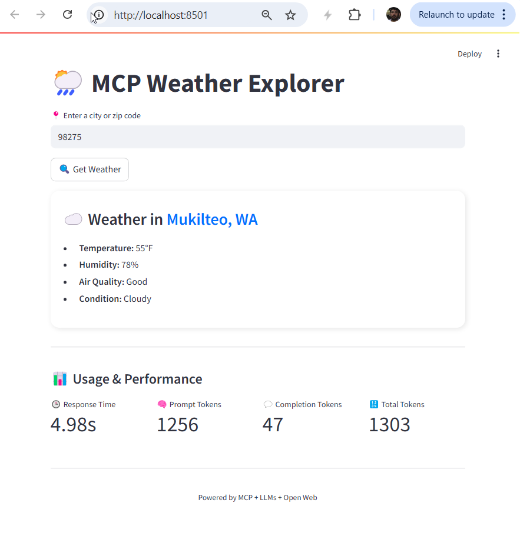

# 🌦️ MCP Weather Scraper

This project is an experimental implementation of the **[Model Context Protocol (MCP)](https://github.com/modelcontextprotocol)** using a lightweight LLM via ** OpenAI** and FastAPI to fetch and structure real-time weather information from open web sources. The goal is to explore how LLMs can interact with tools and serve as intelligent agents for retrieving and reasoning over unstructured web data.

---

[](https://www.python.org/)
[](LICENSE)
[](https://github.com/EXPESRaza/mcp_weather_scraper/issues)

---

## 🚀 Features

- ✅ MCP-compliant server with weather scraping via browser search
- ✅ Integration with OpenAI LLM (e.g., gpt-3.5-turbo)
- ✅ FastAPI server provides weather info as callable MCP tool
- ✅ Automatic HTML parsing using `selectolax` for performance
- ✅ LLM handles unstructured web content extraction into structured schema
- ✅ Streamlit app frontend for user interaction
- ✅ Response caching using `functools.lru_cache`

---

## 🧠 Refresh Before You Dive In  
**Top 5 Concepts to Brush Up On for This Repo**

| 🧩 Concept | 🔍 What It Is | ⚙️ Why It Matters |
|-----------|---------------|-------------------|
| **Model Context Protocol (MCP)** | A new protocol for tool-calling in LLMs | Powers structured AI-agent communication |
| **Uvicorn** | Fast ASGI server for Python web apps | Hosts the FastAPI-based MCP server |
| **Selectolax** | High-speed HTML parser | Efficiently scrapes and extracts weather data |
| **`functools.lru_cache`** | Built-in Python decorator to cache function calls | Boosts performance by avoiding repeated fetches |
| **Token Usage Metrics (OpenAI)** | Info on how many tokens were used in an LLM call | Helps track cost and optimize prompt design |

> 💡 Even if you're familiar with Python and APIs, these tools represent **cutting-edge AI stack engineering** and are worth a quick look!

---

## 📊 Token Usage & Performance Metrics
The Streamlit UI now includes:

- **⏱️ Response Time**  
  Time taken to fetch and process weather info

- **🧠 Prompt Tokens**  
  Tokens used in the LLM prompt

- **💬 Completion Tokens**  
  Tokens generated in the LLM response

- **🔢 Total Tokens**  
  Total token count per request, useful for cost tracking

These are displayed in a clean visual layout under each result card.

---

## 🖥️ Streamlit App Preview

<p align="center">
  
</p>

---

## Requirements

- Python 3.9 or higher
- Dependencies listed in `requirements.txt`

---

## 🛠️ Setup

1. **Clone the repo**
   ```bash
   git clone https://github.com/your-username/mcp_weather_scraper.git
   cd mcp_weather_scraper
   ```
2. **Create and activate a virtual environment**
   ```bash
   python -m venv .venv
   .venv\Scripts\activate  # On Windows
   ```
3. **Install dependencies**
   ```bash
   pip install -r requirements.txt
   ```
4. **Set environment variables**
   Create a .env file in the root directory and add your OpenAI API key
   ```env
   OPENAI_API_KEY=your_openai_api_key
   ```
5. **Running the Server**
   ```bash
   uvicorn server:app --reload
   ```
   The server will be available at http://localhost:8000.
   You can access the API documentation at:
   - Swagger UI: http://localhost:8000/docs
   - ReDoc: http://localhost:8000/redoc
6. **Making a Request**
   ```bash
   python client.py
   ```
   OR
   ```bash
   curl -X POST http://localhost:8000/weather -H "Content-Type: application/json" -d '{"location": "Seattle"}'
   ```
   The script sends a POST request with the following payload:
   ```json
   {
     "location": "Seattle"
   }
   ```
   The server will respond with weather data in JSON format, such as:
   ```json
   {
     "location": "Seattle",
     "temperature": "15°C",
     "humidity": "80%",
     "air_quality": "Good",
     "condition": "Cloudy"
   }
   ```

## 📦 Folder Structure
```bash
.
📁 mcp_weather_scraper/
│
├── assets/
│   └── streamlit_screenshot.png
├── server.py          # MCP-compatible tool server
├── client.py          # MCP client that interacts with model + tools
├── data_models.py     # Pydantic schemas for request/response
├── utils.py           # HTML cleaning, scraping, etc.
├── requirements.txt
└── .env
```

## 📄 License
```yaml
This project is licensed under the MIT License.
```
